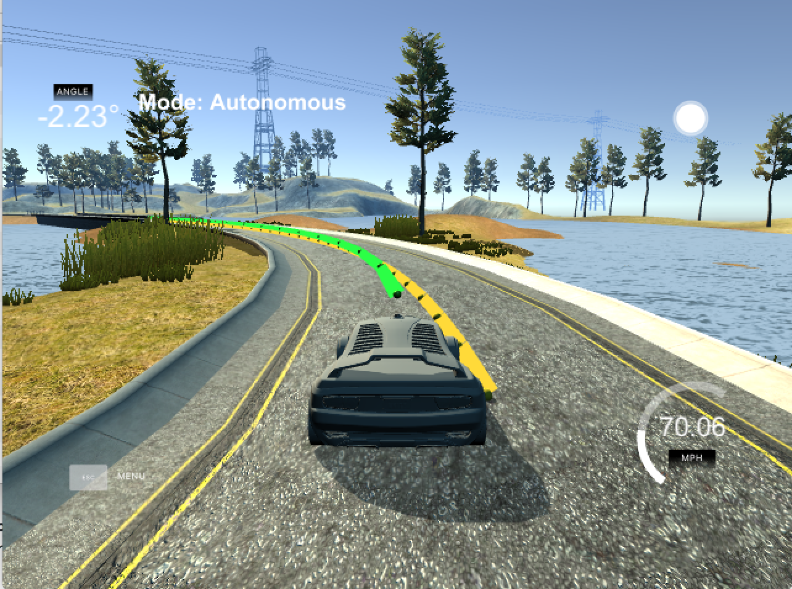
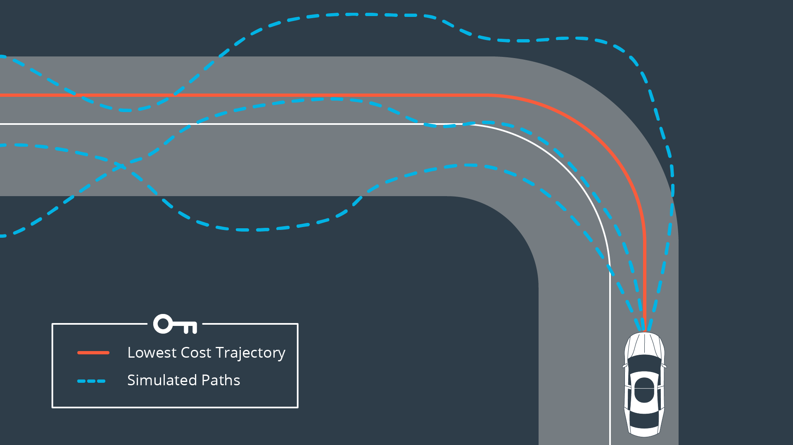
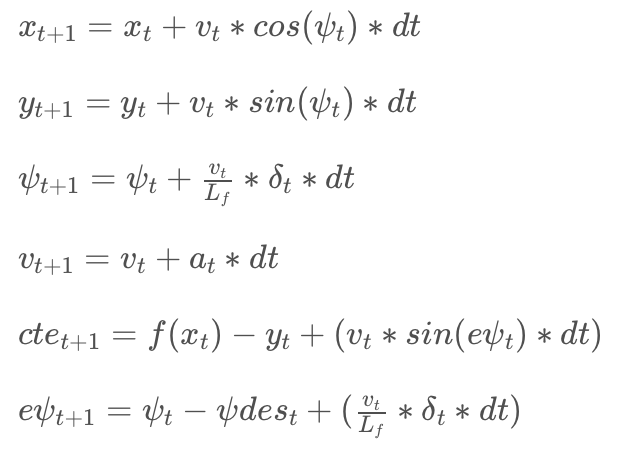

# CarND-Controls-MPC
Self-Driving Car Engineer Nanodegree Program

By: Chris Gundling

---

## Dependencies

* cmake >= 3.5
 * All OSes: [click here for installation instructions](https://cmake.org/install/)
* make >= 4.1
  * Linux: make is installed by default on most Linux distros
  * Mac: [install Xcode command line tools to get make](https://developer.apple.com/xcode/features/)
  * Windows: [Click here for installation instructions](http://gnuwin32.sourceforge.net/packages/make.htm)
* gcc/g++ >= 5.4
* Fortran Compiler
  * Mac: `brew install gcc` (might not be required)
  * Linux: `sudo apt-get install gfortran`. Additionall you have also have to install gcc and g++, `sudo apt-get install gcc g++`.
* [Ipopt](https://projects.coin-or.org/Ipopt)
* [CppAD](https://www.coin-or.org/CppAD/)
  * Mac: `brew install cppad`
  * Linux `sudo apt-get install cppad` or equivalent.
* [Eigen](http://eigen.tuxfamily.org/index.php?title=Main_Page). This is already part of the repo so you shouldn't have to worry about it.
* Simulator. You can download these from the [releases tab](https://github.com/udacity/self-driving-car-sim/releases).
* Not a dependency but read the [DATA.md](./DATA.md) for a description of the data sent back from the simulator.

## Basic Build Instructions
1. Clone this repo.
2. Make a build directory: `mkdir build && cd build`
3. Compile: `cmake .. && make`
4. Run it: `./mpc`.

## The Model
This goal of this project was to implement Model Predictive Control (MPC) for an autonomous vehicle. MPC determines a vehicle trajectory with the lowest cost relative to the reference trajectory (waypoints) using an optimizer. Minimizing this cost functions allows for finding the appropriate actuations for the vehicle. To perform this type of control, a model of the vehicle must exist that defines the current state of the vehicle and the update equations to update that state at the following time step. A global kinematic model was used for this project that is described in further detail in the following section.

## Vehicle State, Actuators and Update
In this project a global kinematic model was used to describe the state of the vehicle. This is a simplified model of the vehicle that does not consider things such as vehicle slip or the physics of the tire on the road surface. The vehicle state is defined by the vehicle position (Px, Py), the vehicle orientation (ψ) and the vehicle velocity (v) and the errors (cross track (cte) and orientation (eψ). The cte and orientation error are shown in the following figure.

This gives the state vector as [x,y,ψ,v,cte,eψ]. The vehicle state will be updated based on the actuations (control) parameters of the vehicle. The following equations show the state update equations. 

## Timestep Length and Elapsed Duration (N & dt)
Two important parameters for the timestep length (N) and the timestep duration (dt). Multiplying these two parameters together determines the total time (T) for which future predictions are made with the model. N is the number of timesteps in the horizon and dt is how much time elapses between actuations. MPC attempts to approximate a continuous reference trajectory by means of discrete paths between actuations. Larger values of dt result in less frequent actuations, which makes it harder to accurately approximate a continuous reference trajectory.

I started this project assuming that the total time (T) should be 1-2 seconds based on the lecture advice. Therefore, I started with N = 20 and dt = 0.1s. Having dt = 0.1s also meant that the timestep was equivalent to the built-in latency of the system. After trial and error in the simulator, I reduced N to be 15, but left dt = 0.1. This meant that less points needed to be optimized by the MPC, but still allowed for paths that projected far enough into the future for successful driving. 

## Overall MPC Process (Polynomial Fits, Preprocessing, etc…)
This section covers the general process that was followed to implement the MPC algorithm. One important understanding is that when MPC is implemented, only the first set of control inputs is actually used for the vehicle. This brings the vehicle to a new state and then we repeat the process.

The following are the steps:

1. Initial setup - Define the length of the trajectory, N, and duration of each timestep, dt. Also define all the components of the cost function (state, actuators, etc) and their associated constants. Finally set the upper and lower bounds for all variables and constraints.
2.	Get the current vehicle state from the simulator.
3.	Convert the waypoint coordinates (reference trajectory) to the vehicles coordinate frame and then fit a polynomial to the waypoints.
4.	Predict a new vehicle state at 100ms in the future to account for latency.
5.	Calculate cross track error and orientation error values.
6.	MPC Loop:
- Pass the current state (considering latency) as the state to the model predictive controller.
- We call the optimization solver. Given the state, the solver will return the vector of control inputs that minimizes the cost function.
- Apply the control input to the vehicle.
- Then repeat the 2-6 process.

## Polynomial Fits
A polynomial fit is used to fit the waypoints of the reference path. After experimenting with both 2nd and 3rd order fits, I decided to use a second order fit. Both 2nd or 3rd order proved successful for getting the vehicle to drive, so I picked the simpler method.

## Tuning the Cost Function
One of the most important findings of this project was the importance of tuning the cost function. Multiplying a part of the cost function by a value > 1 will add more influence to the solver in minimizing that parameter. For example, the sequential steering cost parameter was found to be the most influential parameter on vehicle performance and a multiplying factor of 60000 was used in my implementation. This resulted in smooth steering transitions and solved many of the oscillatory steering issues that I was originally facing. 

## Latency
In a real car there are delays as vehicle actuator commands propagate through the system.  The simulator for this project was setup to have a 100ms latency to create a realistic scenario for implementing the MPC. To make sure that I had implemented the MPC correctly, I first set the latency to 0ms. This allowed for tuning of the time constats and cost function constants without having to worry about latency. Once my model was able to drive the vehicle around the simulator track with no latency, I slowly increased the latency to see what effects it would have.

With low latency (10-20ms), the vehicle would slightly oscillate about its path, but was still able to drive around the track. Once the latency was increased to 50ms, this was no longer the case and the oscillations about the reference path would grow uncontrollably.  This was addressed by applying the MPC to a future state. The current vehicle state and actuations are received from the simulator, at which point the vehicle state was updated 100ms forward in time. After trying different combinations of updates, I found that it was sufficient to only update the vehicles x-position and orientation. I believe that this is the case because in the vehicle’s coordinate frame the orientation is always zero, which means that y-position will not change (sin(0)=0). Using this technique, the oscillations were no longer noticeable and the vehicle drove successfully around the track at 70 mph with 100ms latency.

## Conclusions
The implemented MPC model was able to drive in the simulator at relatively high speed compared to the deep learning or PID methods that have been previously implemented. The MPC algorithm was also successfully able to handle 100ms of system latency. I was surprised at the amount of cost function parameter tuning (multiplication factors) that was required to reach a successful implementation. This appears to be the biggest area for potential improvement. A method similar to twiddle for the PID controller could be implemented to tune these multiplication factors. In addition, a dynamic model that considers many more details of the vehicle movement would be a significant improvement. To fully understand the benefits of the dynamic model, a more complex Unity simulator vehicle would also need to be implemented.
